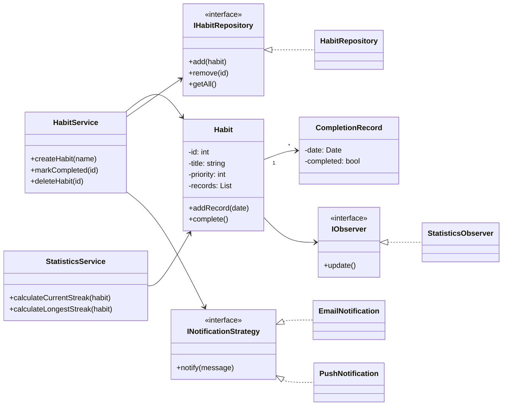

```mermaid
classDiagram
direction LR

%% =====================
%% CORE DOMAIN
%% =====================
class Habit {
    -id: int
    -title: string
    -priority: int
    -records: List<CompletionRecord>
    +addRecord(date)
    +complete()
}

class CompletionRecord {
    -date: Date
    -completed: bool
}

Habit "1" --> "*" CompletionRecord

%% =====================
%% SERVICE LAYER
%% =====================
class HabitService {
    +createHabit(name)
    +markCompleted(id)
    +deleteHabit(id)
}

class StatisticsService {
    +calculateCurrentStreak(habit)
    +calculateLongestStreak(habit)
}

HabitService --> Habit
StatisticsService --> Habit

%% =====================
%% REPOSITORY (Pattern 1)
%% =====================
class IHabitRepository {
    <<interface>>
    +add(habit)
    +remove(id)
    +getAll()
}

class HabitRepository

IHabitRepository <|.. HabitRepository
HabitService --> IHabitRepository

%% =====================
%% STRATEGY (Pattern 2)
%% =====================
class INotificationStrategy {
    <<interface>>
    +notify(message)
}

class EmailNotification
class PushNotification

INotificationStrategy <|.. EmailNotification
INotificationStrategy <|.. PushNotification

HabitService --> INotificationStrategy

%% =====================
%% OBSERVER (Pattern 3)
%% =====================
class IObserver {
    <<interface>>
    +update()
}

class StatisticsObserver

IObserver <|.. StatisticsObserver
Habit --> IObserver
```
